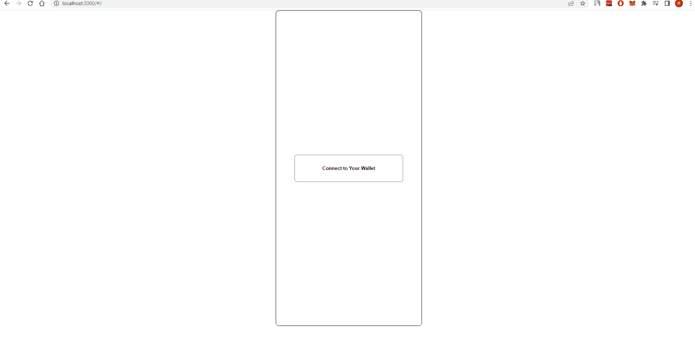

## WEB3 NFT MINT PROJECT
This project provides you to create an NFT from selected image with metadata.


### Technologies that used

* Frontend side developed by using **React** with **typescript**.
* **Hardhat** used for implementing smart-contract.
* Used **@openzeppelin** library functions
* Ethereum used for providing block-chain network.
* Used **moralis** to keep image and metadata as a JSON.
* Rinkeby network used

### Pre-request 
* Before start to use application, you have to do something . 
* you need to create `.env` file to main directory and define some variable in this file.
```ts
REACT_APP_RINKEBY_RPC_URL =  // it refers RINKEBY PUBLIC URL 
REACT_APP_ETHERSCAN_KEY = // it is referring ETHERSCAN KEY
REACT_APP_PRIVATE_KEY = // you should give your wallet key, from metamask

REACT_APP_MORALIS_SERVER = // MORALIS server URL
REACT_APP_APP_ID = // MORALIS APP ID
```

* You have to fill all environment variables.

### Installation
* in order to run the application, you have to install all packages.
```node
npm i
```

### Run the Application
* Before Run the frontend, we have to run `npm run smart-contract` script
* If you filled `.env` variables correctly, `npm run smart-contract` would extract two files under `Utils/Generated`.
* One is **contract address** json file that include contact address from **smart-contract**.
* Other file name is **NFTMinted.json** that included **smart-contact** api. (This copied directly smart-contract artifact)
* Then, let's run the application with `npm run start`
* It runs `localhost:3000`


### The Flow

* Firstly, we have to connect our **wallet**, by using **metaMask**
* If you try to connect directly wallet without connecting the wallet, you will relocate to **welcome** page
* Sample GIF is given



* After authenticated clearly, we are selecting image from **local**
* You must give a **name** your NFT
* you can define metadata your nft
* you should specified a price for your NFT
* Then, after click mint button you should confirm your transaction in metamask.
Above flow try to visualize below gif file


* After mint process done, we can see our nft in [opensea](https://testnets.opensea.io/).
* Below step show us how to find our NFT in opensea.


### References
* [Rinkedby](https://www.rinkeby.io)
* [Ethersan](https://rinkeby.etherscan.io/)
* [Faucets](https://faucets.chain.link/rinkeby)
* [Moralis](https://moralis.io/)
* [Remix IDE](https://remix.ethereum.org/#optimize=false&runs=200&evmVersion=null&version=soljson-v0.8.7+commit.e28d00a7.js)